# 🏥 MediSuite AI Agent --- AI-Powered Healthcare Insurance Automation Platform

<p align="center">
  
  
  
  
  
  
</p>

## 🚀 Overview

MediSuite AI Agent is a full-stack, AI-powered web application that automates the medical insurance claim lifecycle --- from scanned document to verified, risk-scored, fraud-checked claim. It combines OCR, NLP, and Machine Learning with a Flask + MySQL backend to turn a photo or PDF of a hospital bill into structured, validated, and analyzed claim data.

### The Problem It Solves

Insurance claim processing is traditionally manual: staff read scanned bills, retype patient and hospital details, cross-check policy documents, and eyeball claims for fraud. MediSuite AI Agent automates each of these steps with an end-to-end pipeline:

- OCR reads scanned bills and prescriptions.
- Smart autofill extracts patient name, hospital, diagnosis, and bill amount automatically.
- NLP analysis pulls out medical entities --- conditions, medications, dosages, doctors.
- Rule-based verification checks the claim against submitted records.
- ML models predict claim approval likelihood and flag potential fraud.
- AI summarization condenses long medical reports into short, readable summaries.

### Who Is It For?

- Insurance companies / TPAs looking to explore claims automation.
- Developers & students learning how OCR, NLP, and ML combine in a real Flask application.
- Anyone prototyping a healthcare-insurance workflow end to end.

## ✨ Features

MediSuite AI Agent is built as a 9-phase pipeline, with each phase available as its own page and connected to the ones before it.

### 🔐 1. User Authentication
- Registration and login with hashed passwords.
- Session-based access control --- all core tools require login.
- Logout with secure session termination.

### 📤 2. File Upload
- Upload scanned medical bills, prescriptions, and reports (PDF, PNG, JPG, JPEG, GIF, DOC, DOCX).
- File type validation and secure filename handling (`werkzeug.secure_filename`).
- 16 MB upload limit with auto-created `uploads/` storage.

### 🔍 3. OCR Text Extraction
- Extracts text from images and PDFs using Tesseract OCR (`pytesseract`) and Poppler (`pdf2image`) for PDF-to-image conversion.
- Handles multi-page PDFs and common scan-quality issues.
- Persists raw OCR output per user for reuse across later phases.

### 🧾 4. Smart Claim Autofill
- Extracts Patient Name, Hospital Name, Diagnosis, and Bill Amount from raw OCR text.
- Combines regex + keyword-context matching with fuzzy string matching (`difflib.SequenceMatcher`) to tolerate OCR misspellings.
- Confidence scoring ranks multiple field candidates and picks the best match.

### 🧠 5. NLP Medical Analysis
- Built on spaCy with a custom pipeline: dictionary lookups, NER, and phrase matching.
- Extracts medical entities: conditions/diseases, medications, dosages, and doctor names.
- Cleans and normalizes noisy OCR text before analysis.

### ✅ 6. Insurance Claim Verification
- Rule engine that cross-checks extracted claim data against submitted records.
- Flags mismatches (e.g., inconsistent patient/hospital details) and produces a verification score.
- Full verification history per user.

### 📊 7. AI Claim Approval Prediction
- Logistic Regression model (scikit-learn Pipeline) trained on historical claim data.
- Outputs an approval/rejection prediction with probability.

Current test performance:

| Metric    | Value  |
|-----------|--------|
| Accuracy  | 92.0%  |
| Precision | 99.68% |
| Recall    | 91.07% |
| F1 Score  | 95.18% |
| ROC-AUC   | 98.4%  |
| Trained on | 800 records |

### 🚨 8. Fraud Detection
- Isolation Forest (200 estimators, 18% contamination) combined with a hybrid rule engine covering:
  - Missing insurance ID or policy number
  - Abnormally high bill amount (vs. dataset mean)
  - Unusual claim frequency
  - Invalid or inconsistent dates
  - Rejected verification / low verification score
  - Missing doctor or diagnosis details
  - Duplicate claims
- Model + rules combine into a single fraud risk score and flag.

### 📝 9. Medical Report Summarizer
- Primary: Hugging Face transformer (BART/T5) for abstractive summarization.
- Automatic fallback to a rule-based extractive summarizer when no internet/GPU is available, so the feature always works offline.
- Reports compression ratio and which method (`model_used`) generated each summary.

### 📁 Claim & History Management
Every phase (OCR, autofill, verification, prediction, fraud check, summary) saves results to MySQL and exposes a history page so users can revisit past claims.

### 📈 10. Analytics Dashboard (in progress)
A unified dashboard summarizing claim volume, approval rates, and fraud flags is under active development.

## 🛠️ Tech Stack

| Layer | Technology |
|---|---|
| Backend | Python 3.10+, Flask 3.1.3 |
| Database | MySQL via Flask-MySQLdb / mysqlclient |
| OCR | Tesseract (pytesseract), Poppler (pdf2image), Pillow |
| NLP | spaCy |
| Machine Learning | scikit-learn (Logistic Regression, Isolation Forest) |
| AI Summarization | Hugging Face Transformers (BART/T5) with rule-based fallback |
| Templating | Jinja2 (via Flask) |
| Frontend | HTML5, CSS3 |
| Session Management | Flask server-side sessions |
| Dev Tools | Visual Studio Code, Git, GitHub |

## 🏗️ Architecture / How It Works

```
Browser (HTML/CSS)
       ↓  Upload scanned bill/report
Flask Router (app.py)
       ↓
File Upload Handler ──► uploads/
       ↓
OCR Engine (Tesseract + Poppler) ──► raw text
       ↓
Smart Autofill (regex + fuzzy match) ──► structured fields
       ↓
NLP Medical Analysis (spaCy) ──► entities (conditions, meds, doctors)
       ↓
Claim Verification (rule engine) ──► verification score
       ↓
┌─────────────────────────────┬─────────────────────────────┐
│ Claim Approval Prediction   │ Fraud Detection              │
│ (Logistic Regression)       │ (Isolation Forest + rules)   │
└─────────────────────────────┴─────────────────────────────┘
       ↓
Medical Report Summarizer (BART/T5 or extractive fallback)
       ↓
MySQL Database (results + history)
       ↑
Jinja2 Templates ──► Browser
```

### Key Workflows

**1. Upload → OCR → Autofill**
```
POST /upload → save file → /ocr → pytesseract/pdf2image → raw text
            → extract_claim_fields() → patient, hospital, diagnosis, bill amount
```

**2. Claim Verification**
```
POST /claim-verification → build_fields_from_records() → verify_claim()
                          → rule engine → verification score → save to DB
```

**3. Claim Approval Prediction**
```
POST /claim-prediction → predict() → Logistic Regression pipeline
                        → approval probability → save + history
```

**4. Fraud Detection**
```
POST /claim-fraud → detect_fraud() → Isolation Forest score
                   + rule engine (9 rules) → combined fraud flag
```

**5. Medical Report Summarization**
```
POST /medical-summary → summarize() → try transformer (BART/T5)
                        → fallback to extractive summary if unavailable
                        → compression ratio + model_used
```

## 📂 Folder Structure

```
MediSuite-AI-Agent/
│
├── app.py                        # Core Flask app — all routes & business logic
├── requirements.txt              # Python dependencies
├── .gitignore
│
├── ai/
│   ├── medical_summarizer.py     # BART/T5 summarization + extractive fallback
│   ├── model_loader.py           # Loads/caches the Hugging Face pipeline
│   └── text_cleaner.py           # OCR text cleaning utilities
│
├── extractor/
│   ├── claim_extractor.py        # Phase 4: regex + fuzzy-match autofill
│   ├── claim_verifier.py         # Phase 6: rule-based claim verification
│   └── medical_nlp.py            # Phase 5: spaCy medical entity extraction
│
├── ml/
│   ├── predict_claim.py          # Phase 7: Logistic Regression prediction
│   ├── preprocessing.py          # Feature prep for approval model
│   ├── train_model.py            # Training script for approval model
│   ├── detect_fraud.py           # Phase 8: Isolation Forest + rule engine
│   ├── fraud_preprocessing.py    # Feature prep for fraud model
│   ├── train_fraud_model.py      # Training script for fraud model
│   ├── generate_dataset.py       # Synthetic dataset generator (claims)
│   └── generate_fraud_dataset.py # Synthetic dataset generator (fraud)
│
├── models/
│   ├── model_metrics.json        # Approval model performance
│   └── fraud_model_stats.json    # Fraud model performance
│
├── dataset/
│   ├── insurance_claim_dataset.csv
│   └── fraud_detection_dataset.csv
│
├── templates/                    # Jinja2 HTML templates (auth, OCR, claims,
│                                  # verification, prediction, fraud, summary,
│                                  # dashboard, and history pages for each)
│
├── static/
│   └── css/
│
├── tests/
│   ├── test_extractor.py
│   ├── test_nlp.py
│   ├── test_claim_verifier.py
│   ├── test_claim_prediction.py
│   └── test_fraud_detection.py
│
└── screenshots/
    ├── login.png
    ├── register.png
    ├── dashboard.png
    ├── upload.png
    ├── ocr.png
    ├── claim-autofill.png
    ├── nlp.png
    ├── verification.png
    ├── prediction.png
    ├── fraud.png
    └── summary.png
```

> Note: Trained model files (`*.pkl`, `*.joblib`) are excluded from version control via `.gitignore` and should be generated locally using the scripts in `ml/`.

## ⚙️ Installation & Setup

### Prerequisites
- Python 3.10+
- MySQL 8.0+
- Tesseract OCR installed and on your PATH (Windows users: install via the UB-Mannheim build)
- Poppler for Windows added to your PATH (required by `pdf2image`)
- pip

### 1. Clone the Repository
```bash
git clone https://github.com/mukul135/MediSuite-AI-Agent.git
cd MediSuite-AI-Agent
```

### 2. Create a Virtual Environment
```bash
python -m venv venv
venv\Scripts\activate        # Windows
source venv/bin/activate     # macOS/Linux
```

### 3. Install Dependencies
```bash
pip install -r requirements.txt
python -m spacy download en_core_web_sm
```

### 4. Set Up the MySQL Database
```sql
CREATE DATABASE medisuite;
USE medisuite;
-- Run your schema / migration scripts here for:
-- users, ocr_results, claims, claim_verification,
-- claim_prediction, claim_fraud, medical_analysis, medical_summary
```

### 5. Configure Database Credentials
Update the MySQL configuration in `app.py` (or migrate to environment variables --- see Future Improvements):
```python
app.config['MYSQL_HOST']     = 'localhost'
app.config['MYSQL_USER']     = 'root'
app.config['MYSQL_PASSWORD'] = 'your_mysql_password'
app.config['MYSQL_DB']       = 'medisuite'
```

### 6. Train the ML Models (first run only)
```bash
python ml/train_model.py
python ml/train_fraud_model.py
```
This generates the `.pkl` model files consumed by `predict_claim.py` and `detect_fraud.py`.

### 7. Run the Application
```bash
python app.py
```
The Flask development server should start at: `http://127.0.0.1:5000`

## 🧪 Usage

1. **Register / Login** --- create an account and sign in.
2. **Upload a document** --- go to `/upload` and submit a scanned bill, prescription, or report.
3. **Run OCR** --- extract raw text from the uploaded file.
4. **Autofill claim fields** --- patient name, hospital, diagnosis, and bill amount are extracted automatically.
5. **Run NLP analysis** --- view extracted conditions, medications, dosages, and doctors.
6. **Verify the claim** --- check extracted data against submitted records for a verification score.
7. **Predict approval** --- get an ML-based approval probability for the claim.
8. **Check for fraud** --- run the fraud detection engine for a risk score and flags.
9. **Summarize the report** --- generate a short AI summary of the full medical report.
10. **Review history** --- revisit past OCR, claims, verifications, predictions, fraud checks, and summaries from their respective history pages.

## 📸 Screenshots

### 🔐 Login
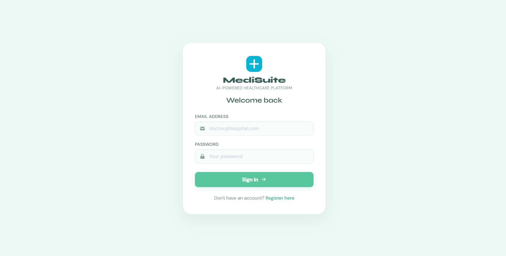

### 📝 Registration
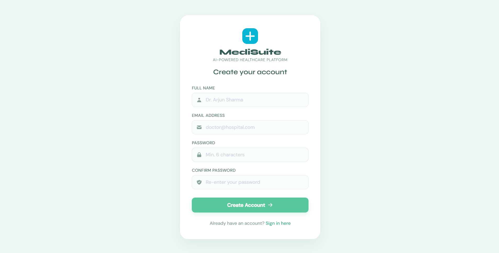

### 📊 Dashboard
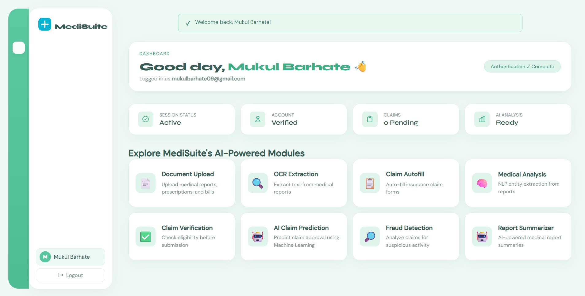

### 📤 Document Upload
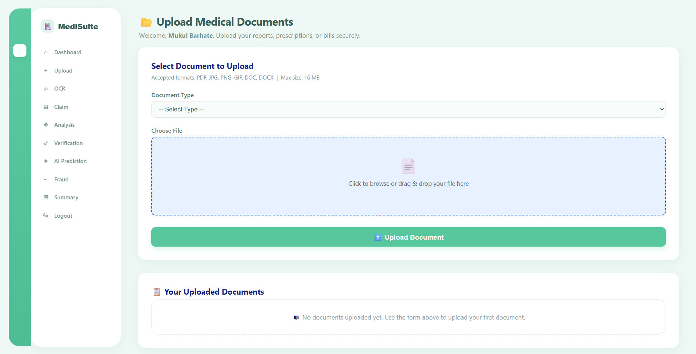

### 🔍 OCR Text Extraction
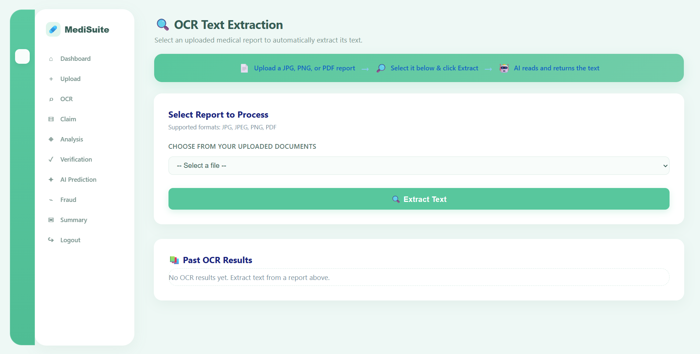

### 🧾 Claim Autofill
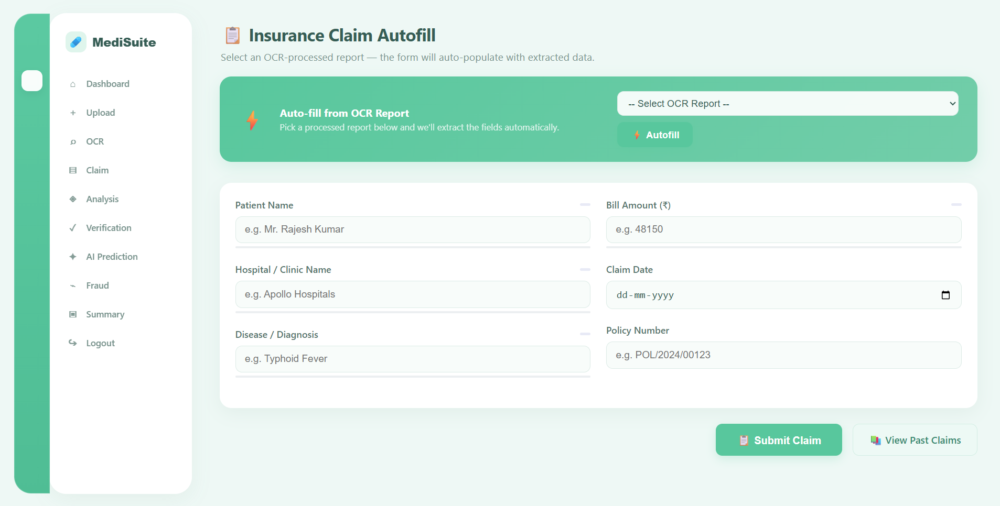

### 🧠 NLP Medical Analysis
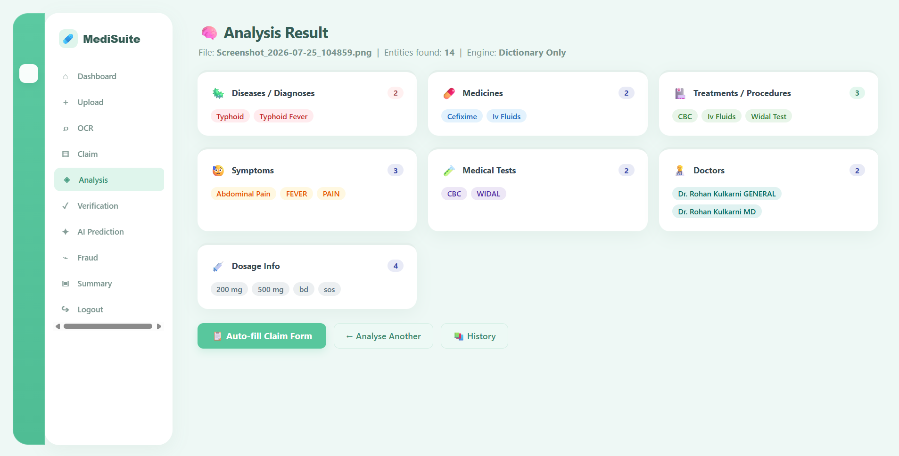

### ✅ Claim Verification
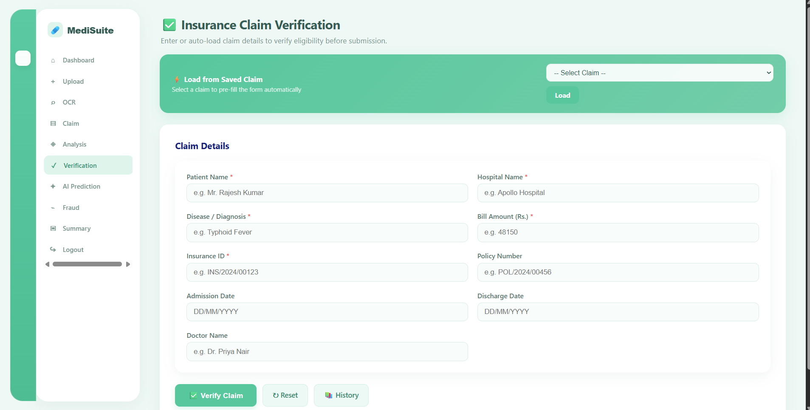

### 📈 Claim Approval Prediction
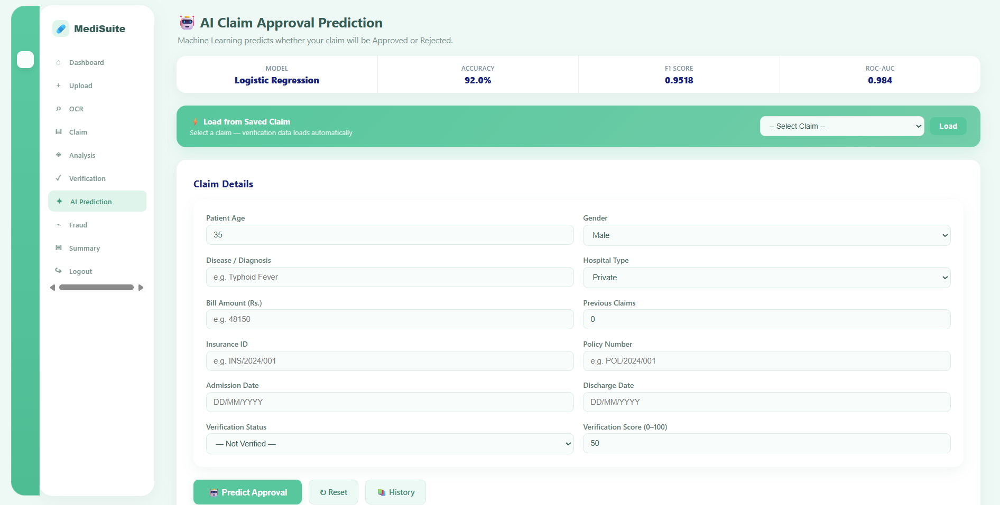

### 🚨 Fraud Detection
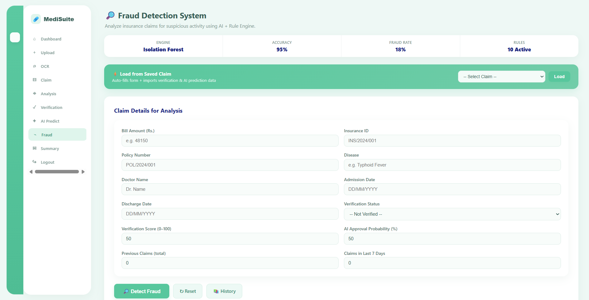

### 📝 Medical Report Summarizer
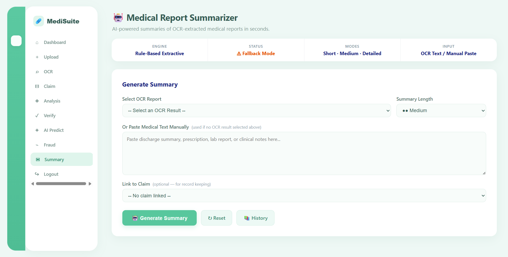

## 🧪 Testing

Test coverage lives in `tests/` and includes:
- `test_extractor.py` --- claim field extraction accuracy
- `test_nlp.py` --- spaCy medical entity extraction
- `test_claim_verifier.py` --- rule-based verification logic
- `test_claim_prediction.py` --- approval model predictions
- `test_fraud_detection.py` --- fraud rule engine + Isolation Forest scoring

Run all tests with:
```bash
pytest tests/
```

## 🚧 Challenges & Learnings

**1. OCR Accuracy on Real-World Scans**
Scanned hospital bills vary widely in quality. Getting clean text out of Tesseract required careful PDF-to-image conversion via Poppler and text-cleaning steps before any downstream extraction.

**2. Reliable Field Extraction from Unstructured Text**
Pure regex wasn't enough --- OCR misspellings needed fuzzy matching (`difflib.SequenceMatcher`) layered with keyword-context rules and confidence scoring to reliably pick the right patient name, hospital, and bill amount out of noisy text.

**3. Combining ML with Rule-Based Fraud Detection**
An Isolation Forest alone couldn't explain why a claim looked suspicious. Layering nine explicit business rules (missing IDs, abnormal bill amounts, duplicate claims, etc.) on top of the anomaly score made fraud flags both accurate and explainable.

**4. Graceful AI Degradation**
The Hugging Face summarizer needs internet/compute that isn't always available. Building a rule-based extractive fallback ensured the summarizer phase always returns a usable result.

**5. End-to-End Data Flow**
Each phase depends on data saved by the previous one (OCR → autofill → verification → prediction → fraud → summary). Structuring the MySQL schema and Flask routes to pass this data cleanly, while keeping per-user history for every phase, took careful planning.

### Learnings
- Practical integration of OCR, NLP, and classical ML in one Flask app.
- Building explainable ML systems by combining model scores with rule engines.
- Designing fallback strategies for AI features that depend on external resources.
- Structuring a multi-phase MySQL schema with per-feature history tracking.

## ⚠️ Limitations

- The current dataset is synthetic/limited; real-world claim data would improve model reliability.
- OCR accuracy depends heavily on scan quality and Tesseract's language model.
- The ML models are not clinically or actuarially validated and should not be used for real insurance decisions.
- Secrets (DB password, Flask secret key) are currently hardcoded in `app.py` and should be moved to environment variables before any deployment.
- The Analytics Dashboard (Phase 10) is not yet complete.

## 🔮 Future Improvements

- 📊 Complete the Analytics Dashboard --- claim volume, approval rate, and fraud trend visualizations.
- 🔐 Environment Variable Management --- move DB credentials and secret key to `.env` via `python-dotenv`.
- 🔒 Stronger password hashing --- migrate to `werkzeug.security.generate_password_hash` / bcrypt if not already at production strength.
- 🛡️ CSRF Protection --- add Flask-WTF CSRF tokens to all forms.
- ☁️ Cloud Deployment --- deploy via Render/Railway with a managed MySQL instance.
- 📄 Downloadable Claim Reports --- export verified claims and summaries as PDF.
- 📱 Mobile-Responsive UI --- refine templates for smaller screens.
- 🤖 Model Improvements --- larger, more diverse training data; hyperparameter tuning for both the approval and fraud models.

## 👨‍💻 Author

**Mukul**
Diploma Final-Year Student, Computer Engineering --- Government Polytechnic, Pune

GitHub: [github.com/mukul135](https://github.com/mukul135)

**Skills & Interests**
- Python & Flask
- Machine Learning & NLP
- AI/ML Project Development
- Full-Stack Web Development
- Git & GitHub

## 📄 License

This project is licensed under the MIT License.

```
MIT License

Copyright (c) 2026 Mukul

Permission is hereby granted, free of charge, to any person obtaining a copy
of this software and associated documentation files (the "Software"), to deal
in the Software without restriction, including without limitation the rights
to use, copy, modify, merge, publish, distribute, sublicense, and/or sell
copies of the Software, and to permit persons to whom the Software is
furnished to do so, subject to the following conditions:

The above copyright notice and this permission notice shall be included in all
copies or substantial portions of the Software.

THE SOFTWARE IS PROVIDED "AS IS", WITHOUT WARRANTY OF ANY KIND, EXPRESS OR
IMPLIED, INCLUDING BUT NOT LIMITED TO THE WARRANTIES OF MERCHANTABILITY,
FITNESS FOR A PARTICULAR PURPOSE AND NONINFRINGEMENT. IN NO EVENT SHALL THE
AUTHORS OR COPYRIGHT HOLDERS BE LIABLE FOR ANY CLAIM, DAMAGES OR OTHER
LIABILITY, WHETHER IN AN ACTION OF CONTRACT, TORT OR OTHERWISE, ARISING FROM,
OUT OF OR IN CONNECTION WITH THE SOFTWARE.
```

<p align="center">
Built with 🩺 by Mukul | Powered by Flask, MySQL, spaCy & scikit-learn
</p>